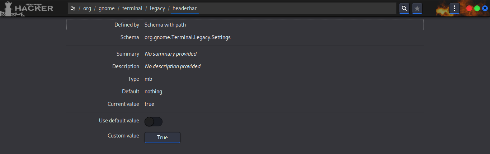
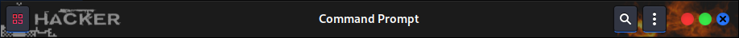
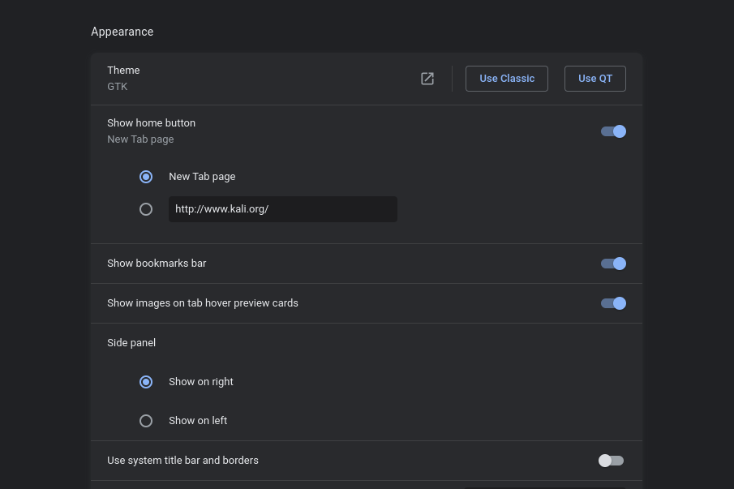

# Include
## style/theme
- Adwaita dark PONIES
- Adwaita light PONIES

## Icon
- Flat-ZOMG-dark
- Flat-ZOMG-light

## Other
- Pixmaps

## Notes
- Recomended for Xfce
- Gnome ok on Tested
- I don't Recomend use local theme/icon!

# To apply

Clone Repository
```bash
git clone https://github.com/cilegordev/Flat-Adwaita ~/Flat-Adwaita
```

Copy Theme/Icon
```bash
sudo cp -r ~/Flat-Adwaitas/Adwaita-light-PONIES /usr/share/themes/ && sudo cp -r ~/Flat-Adwaitas/Adwaita-dark-PONIES /usr/share/themes/ && sudo cp -r ~/Flat-Adwaitas/Flat-ZOMG-light /usr/share/icons/ && sudo cp -r ~/Flat-Adwaitas/Flat-ZOMG-dark /usr/share/icons/ && sudo cp ~/Flat-Adwaita/pixmaps/* /usr/share/pixmaps/
```

## And use tools to apply
- xfce4-appearance-settings
- nwg-look
- dconf-editor to actived this bar </br>
/org/gnome/terminal/legacy/headerbar </br>
Use default value set to : off </br>
Custom value set to : True </br>
```bash
gsettings set org.gnome.Terminal.Legacy.Settings headerbar true
```

- gnome-terminal

- use gtk to actived this bar </br>
chrome://settings/appearance </br>

- google-chrome-stable


# Credits
- [Base on Adwaita](https://gitlab.gnome.org/GNOME/gtk/-/tree/gtk-3-24/gtk/theme/Adwaita)
- [Base on Kali Dark](https://gitlab.com/kalilinux/packages/kali-themes/-/tree/kali/master/share/themes/Kali-Dark)
- [Base on Flat Remix Blue Dark](https://github.com/daniruiz/flat-remix/tree/master/Flat-Remix-Blue-Dark)

# License

[GNU General Public License v3.0](LICENSE)
